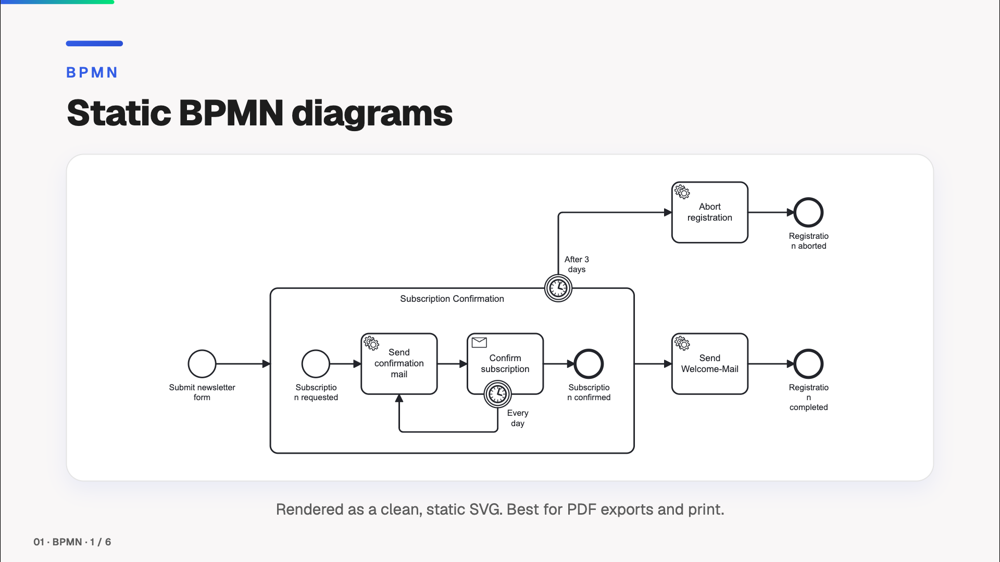

# 📊 slidev-addon-diagram-js

[](https://www.npmjs.com/package/slidev-addon-diagram-js)
[](https://github.com/emaarco/slidev-addon-diagram-js/blob/main/LICENSE)
[](https://emaarco.github.io/slidev-addon-diagram-js/)

Stop pasting flat screenshots of your diagrams into slides. 🎯 This [Slidev](https://sli.dev/) addon embeds the **real** models — BPMN processes, DMN decisions, Team Topologies, Wardley Maps and Event Storming boards — rendered live from their source files.

Present them as crisp static SVGs that survive PDF and PNG export, or open a **live modeler** and build the diagram in front of your audience, mid-talk. ✨



> **Coming from `slidev-addon-bpmn` or `slidev-addon-dmn`?** This package replaces both — your slides need no changes. See the [migration guide](./docs/migrating.md).

## 🚀 Quick Start

1. Install the addon in your Slidev project (see [Installation](#-installation))
2. Place your diagram files (`.bpmn`, `.dmn`, `.tt`, `.owm`, `.storm`) in the `public/` folder
3. Use the components in your slides, for example `<Bpmn>` or `<DmnTable>`

That's it — your diagrams are ready to present!

## 📦 Installation

```bash
npm install slidev-addon-diagram-js
```

Then register the addon in your slide's frontmatter:

```yaml
---
addons:
  - slidev-addon-diagram-js
---
```

Or in your `package.json`:

```json
{
  "slidev": {
    "addons": ["slidev-addon-diagram-js"]
  }
}
```

## 🧩 What's inside

Five notations, each with a static viewer and an interactive modeler. Follow the module link for usage, props and screenshots.

| Module | Components | Details |
|--------|------------|---------|
| **BPMN** | `<Bpmn>`, `<BpmnTokenSimulation>`, `<BpmnModeler>` | [docs/bpmn.md](./docs/bpmn.md) |
| **DMN** | `<DmnDrd>`, `<DmnTable>`, `<DmnSimulate>`, `<DmnModeler>` | [docs/dmn.md](./docs/dmn.md) |
| **Team Topologies** | `<TeamTopologies>`, `<TeamTopologiesModeler>` | [docs/team-topologies.md](./docs/team-topologies.md) |
| **Wardley Maps** | `<WardleyMap>`, `<WardleyMapModeler>` | [docs/wardley-maps.md](./docs/wardley-maps.md) |
| **Event Storming** | `<EventStorming>`, `<EventStormingModeler>` | [docs/event-storming.md](./docs/event-storming.md) |

Every static viewer (`<Bpmn>`, `<DmnDrd>`, `<TeamTopologies>`, `<WardleyMap>`, `<EventStorming>`) renders to a self-contained SVG, so it works in Slidev's PDF and PNG export out of the box.

## 🗺️ Modeler Support

The addon is structured so that further diagram-js based modelers can sit next to the existing ones.

| Modeler | Status |
|---------|--------|
| BPMN | Supported: static viewer, token simulation, modeler |
| DMN | Supported: static DRD, decision table, simulation, modeler |
| Team Topologies | Supported: static viewer, modeler, via [`@miragon/team-topologies-renderer`](https://www.npmjs.com/package/@miragon/team-topologies-renderer) |
| Wardley Maps | Supported: static viewer, modeler, via [`@miragon/wardley-renderer`](https://www.npmjs.com/package/@miragon/wardley-renderer) |
| Event Storming | Supported: static viewer, modeler, via [`@miragon/event-storming-renderer`](https://www.npmjs.com/package/@miragon/event-storming-renderer) |

## 💡 Tips

- **File location**: diagram files must be placed in the `public/` folder
- **Supported formats**: standard BPMN 2.0 and DMN 1.3 XML (exported from Camunda Modeler, bpmn.io, etc.); `.tt`, `.owm` and `.storm` for the Miragon notations
- **Styling**: use Tailwind classes on the component element to control sizing
- **Export**: the static viewers work seamlessly with Slidev's PDF/PNG export features

## 🤝 Contributing

Contributions are welcome! Feel free to report bugs, suggest features via [issues](https://github.com/emaarco/slidev-addon-diagram-js/issues), submit pull requests with improvements, or share your ideas and use cases.

To develop locally: clone the repo and run `npm install`. The dev server runs behind
[portless](https://portless.sh) (a pinned devDependency — no global install) for a stable,
git-worktree-aware `.localhost` URL. Install the proxy daemon once per machine (needs sudo once):

```bash
npx portless service install
```

Then run the example presentation:

```bash
npm run dev        # via portless → https://slidev-addon-diagram-js.localhost
                   # (in a git worktree → https://<worktree>.slidev-addon-diagram-js.localhost)
npm run dev:app    # or run the Slidev server directly, without portless
```

## 🙏 Credits

- [bpmn-js](https://github.com/bpmn-io/bpmn-js), [dmn-js](https://github.com/bpmn-io/dmn-js) and [diagram-js](https://github.com/bpmn-io/diagram-js) by [bpmn.io](https://bpmn.io/)
- The Team Topologies, Wardley Maps and Event Storming renderers by [Miragon](https://github.com/Miragon)
- Inspired by [slidev-addon-excalidraw](https://github.com/haydenull/slidev-addon-excalidraw)
