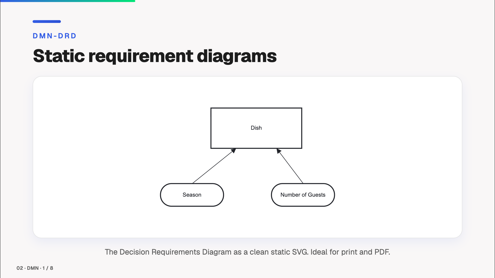

# 📊 slidev-addon-diagram-js

[](https://www.npmjs.com/package/slidev-addon-diagram-js)
[](https://github.com/emaarco/slidev-addon-diagram-js/blob/main/LICENSE)
[](https://emaarco.github.io/slidev-addon-diagram-js/)

Display BPMN 2.0 processes, DMN decisions, Team Topologies, Wardley Maps and Event Storming boards in your [Slidev](https://sli.dev/) presentations. Whether you're presenting workflow designs, explaining business rules, or teaching BPMN and DMN concepts — this addon has you covered! 💡

Powered by [bpmn-js](https://bpmn.io/toolkit/bpmn-js/) and [dmn-js](https://bpmn.io/toolkit/dmn-js/) from bpmn.io and the Miragon modeler renderers, all built on [diagram-js](https://github.com/bpmn-io/diagram-js).

> **Coming from `slidev-addon-bpmn` or `slidev-addon-dmn`?** This package replaces both. See [Migrating](#-migrating-from-slidev-addon-bpmn--slidev-addon-dmn).

## 🚀 Quick Start

1. Install the addon in your Slidev project
2. Place your diagram files (`.bpmn`, `.dmn`, `.tt`, `.owm`, `.storm`) in the `public/` folder
3. Use the components in your slides, for example `<Bpmn>` or `<DmnTable>`

That's it — your diagrams are ready to present!

## Example Slides




## 📦 Installation

```bash
npm install slidev-addon-diagram-js
```

Then register the addon in your slide's frontmatter:

```yaml
---
addons:
  - slidev-addon-diagram-js
---
```

Or in your `package.json`:

```json
{
  "slidev": {
    "addons": ["slidev-addon-diagram-js"]
  }
}
```

## 🔁 Migrating from slidev-addon-bpmn / slidev-addon-dmn

`slidev-addon-diagram-js` replaces both packages. Swap the dependencies:

```bash
npm uninstall slidev-addon-bpmn slidev-addon-dmn
npm install slidev-addon-diagram-js
```

and list the new addon instead of the two old ones:

```yaml
---
addons:
  - slidev-addon-diagram-js
---
```

Component names, props and defaults are unchanged, so your slides need no edits.

## 🧩 Components

**BPMN**

- **`<Bpmn>`** - Static BPMN rendering for PDFs, presentations, and documentation
- **`<BpmnTokenSimulation>`** - Interactive token-based process simulation for live demos
- **`<BpmnModeler>`** - Interactive BPMN modeler for live diagram editing during workshops and trainings, with optional Zeebe / Camunda 7 properties panel

**DMN**

- **`<DmnDrd>`** - Static DRD rendering for PDFs, presentations, and documentation
- **`<DmnTable>`** - Decision Table rendering for visualizing business rules
- **`<DmnSimulate>`** - Decision Table with an input form: evaluate the decision live and highlight the matching rule (DMN's answer to BPMN token simulation)
- **`<DmnModeler>`** - Interactive DMN modeler for live editing during workshops and trainings, with an optional Camunda properties panel

**More modelers**

- **`<TeamTopologies>`** - Static rendering of a Team Topologies diagram
- **`<WardleyMap>`** - Static rendering of a Wardley Map
- **`<EventStorming>`** - Static rendering of an Event Storming board

## 🔧 BPMN Component Reference

### Bpmn Component

Renders BPMN diagrams as static SVG images. Perfect for PDF exports and presentations.

```vue
<Bpmn
  bpmnFilePath="./my-process.bpmn"
  width="100%"
  height="400px"
/>
```

**Props:**

| Name | Type | Default | Description |
|------|------|---------|-------------|
| `bpmnFilePath` | `string` | *required* | Path to the `.bpmn` file (relative to `public/`) |
| `width` | `string` | `'100%'` | Maximum width of the diagram |
| `height` | `string` | `'auto'` | Height of the diagram |

### BpmnTokenSimulation Component

Renders interactive BPMN diagrams with token simulation capabilities. Perfect for process walkthroughs and training.

```vue
<BpmnTokenSimulation
  bpmnFilePath="./my-process.bpmn"
  width="100%"
  height="500px"
/>
```

**Props:**

| Name | Type | Default | Description |
|------|------|---------|-------------|
| `bpmnFilePath` | `string` | *required* | Path to the `.bpmn` file (relative to `public/`) |
| `width` | `string` | `'100%'` | Width of the diagram container |
| `height` | `string` | `'auto'` | Height of the diagram container (defaults to 500px when 'auto') |
| `fullscreen` | `boolean` | `true` | Show the button that expands the simulation to fullscreen |
| `maxScale` | `number` | `2` | Cap on how far a small diagram is enlarged past its native size. Lower keeps it smaller; higher lets it fill more. |

The token simulation provides interactive controls for stepping through process execution with animated token flow.

### BpmnModeler Component

Embeds an interactive BPMN modeler for live diagram editing. Ideal for workshops, trainings, and collaborative sessions where you build diagrams step by step.

```vue
<BpmnModeler
  bpmnFilePath="./my-process.bpmn"
  width="100%"
  height="500px"
/>
```

Or start with a blank canvas (a single start event):

```vue
<BpmnModeler height="500px" />
```

Pass an `engine` to mount an engine-specific properties panel side-by-side with the canvas, so you can edit Zeebe `taskDefinition`s, Camunda 7 expressions, message names, and other technical attributes live:

```vue
<!-- Camunda 8 / Zeebe -->
<BpmnModeler bpmnFilePath="./my-process.bpmn" engine="zeebe" height="500px" />

<!-- Camunda 7 / Platform -->
<BpmnModeler bpmnFilePath="./my-process.bpmn" engine="camunda7" height="500px" />
```

In fullscreen mode, the panel can be hidden and shown again via the toolbar — handy when you need the full canvas width.

**Props:**

| Name | Type | Default | Description |
|------|------|---------|-------------|
| `bpmnFilePath` | `string` | — | Optional path to a `.bpmn` file (relative to `public/`). Omit for a blank diagram. |
| `width` | `string` | `'100%'` | Width of the modeler container |
| `height` | `string` | `'500px'` | Height of the modeler container |
| `engine` | `'zeebe' \| 'camunda7'` | — | Optional engine. Mounts a `bpmn-js-properties-panel` configured for the chosen engine. Omit for a panel-less modeler. |
| `maxScale` | `number` | `2` | Cap on how far a small diagram is enlarged past its native size (e.g. a lone start event on a blank canvas). Lower keeps it smaller; higher lets it fill more. |
| `tokenSimulation` | `boolean` | `false` | Adds the token simulation to the modeler |
| `transactionBoundaries` | `boolean` | `false` | Overlays Camunda 7 transaction boundaries. Only takes effect with `engine="camunda7"`. |

## 🔧 DMN Component Reference

### DmnDrd Component

Renders Decision Requirements Diagrams as static SVG images. Perfect for PDF exports and presentations.

```vue
<DmnDrd
  dmnFilePath="./my-decisions.dmn"
  width="100%"
  height="400px"
/>
```

**Props:**

| Name | Type | Default | Description |
|------|------|---------|-------------|
| `dmnFilePath` | `string` | *required* | Path to the `.dmn` file (relative to `public/`) |
| `width` | `string` | `'100%'` | Maximum width of the diagram |
| `height` | `string` | `'auto'` | Height of the diagram |
| `fontSize` | `string` | `'12px'` | Font size of the diagram labels |

### DmnTable Component

Renders DMN Decision Tables directly in the slide. Perfect for presenting business rules and decision logic.

```vue
<DmnTable
  dmnFilePath="./my-decisions.dmn"
  width="100%"
  decisionId="Decision_Dish"
/>
```

**Props:**

| Name | Type | Default | Description |
|------|------|---------|-------------|
| `dmnFilePath` | `string` | *required* | Path to the `.dmn` file (relative to `public/`) |
| `width` | `string` | `'100%'` | Width of the table container |
| `height` | `string` | `'auto'` | Height of the table container (defaults to 500px when 'auto') |
| `decisionId` | `string` | *first found* | ID of the decision to display (optional, defaults to the first decision table) |
| `fontSize` | `string` | `'12px'` | Font size of the table content |
| `showAnnotations` | `boolean` | `false` | Show or hide the annotations column |
| `showDrdButton` | `boolean` | `false` | Show or hide the built-in "View DRD" button |

### DmnSimulate Component

Renders a Decision Table together with an input form and evaluates it live. Pick the inputs, hit **Simulate**, and the matching rule row is highlighted while the resulting output is shown below the table. Because DMN is declarative (no wandering token like BPMN), this is the DMN equivalent of a token simulation: feed inputs in, watch which rule fires. Evaluation (FEEL matching + hit policies) is powered by the [`@emaarco/dmn-js-simulation`](https://github.com/emaarco/dmn-simulation) package, which evaluates FEEL expressions with the [feelin](https://github.com/nikku/feelin) engine.

Use the **Fullscreen** button next to the form to blow the whole simulation up to the full viewport — handy for wide tables in workshops. Press **Escape** or click **Exit** to return to the slide; the current inputs and result are preserved.

```vue
<DmnSimulate
  dmnFilePath="./my-decisions.dmn"
  width="100%"
  height="340px"
/>
```

**Props:**

| Name | Type | Default | Description |
|------|------|---------|-------------|
| `dmnFilePath` | `string` | *required* | Path to the `.dmn` file (relative to `public/`) |
| `width` | `string` | `'100%'` | Width of the container |
| `height` | `string` | `'340px'` | Height of the decision table |
| `decisionId` | `string` | *first found* | ID of the decision to simulate (defaults to the first decision table) |
| `fontSize` | `string` | `'12px'` | Font size of the table content in the slide |
| `fullscreenFontSize` | `string` | `'12px'` | Font size of the table content in fullscreen (raise it so the table reads from the back of the room) |
| `showAnnotations` | `boolean` | `false` | Show or hide the annotations column |
| `showDrdButton` | `boolean` | `false` | Show or hide the built-in "View DRD" button |

> **Hit policies:** the full DMN set is supported — `UNIQUE`, `ANY`, `PRIORITY`, `FIRST`, `COLLECT` (incl. `SUM`/`MIN`/`MAX`/`COUNT` aggregation), `RULE ORDER` and `OUTPUT ORDER`. The rule(s) the policy actually reports are highlighted strongly; rules that merely matched but were dropped (e.g. under `FIRST`/`PRIORITY`) are shown as faint candidates. `PRIORITY` and `OUTPUT ORDER` use the output's `<outputValues>` list as the priority order. `UNIQUE`/`ANY` show a violation badge when their constraint is broken. Input cells are evaluated as FEEL unary tests via [feelin](https://github.com/nikku/feelin); an empty cell matches any value.
>
> The [`example.md`](./example.md) deck includes one slide per hit policy (`public/hit-policies/*.dmn`) demonstrating each behaviour live.

### DmnModeler Component

Embeds an interactive DMN modeler for live editing. A thumbnail of the DRD is shown in the slide; clicking **Edit** opens the model fullscreen where you can rearrange the DRD and double-click a decision to edit its table. On **Close**, any changes are reflected back in the slide thumbnail. Ideal for workshops, trainings, and collaborative sessions.

```vue
<DmnModeler
  dmnFilePath="./my-decisions.dmn"
  width="100%"
  height="500px"
/>
```

Or start with a blank canvas:

```vue
<DmnModeler height="500px" />
```

Pass `engine="camunda"` to mount the Camunda properties panel side-by-side with the canvas, so you can edit ids, names, and Camunda-specific execution properties live:

```vue
<DmnModeler dmnFilePath="./my-decisions.dmn" engine="camunda" height="500px" />
```

In fullscreen mode, the panel can be hidden and shown again via the toolbar — handy when you need the full canvas width.

**Props:**

| Name | Type | Default | Description |
|------|------|---------|-------------|
| `dmnFilePath` | `string` | — | Optional path to a `.dmn` file (relative to `public/`). Omit for a blank diagram. |
| `width` | `string` | `'100%'` | Width of the modeler container |
| `height` | `string` | `'500px'` | Height of the modeler container |
| `engine` | `'camunda'` | — | Optional engine. Mounts a `dmn-js-properties-panel` configured for Camunda. Omit for a panel-less modeler. |

## 🔧 More Modelers

These three components render their source file as a static SVG, the same way `<Bpmn>` does, so they also work in PDF and PNG exports. They share the same props apart from the name of the file path.

```vue
<TeamTopologies teamTopologiesFilePath="./my-teams.tt" height="400px" />

<WardleyMap wardleyMapFilePath="./my-map.owm" height="400px" />

<EventStorming eventStormingFilePath="./my-board.storm" height="400px" />
```

| Component | File path prop | File format |
|-----------|----------------|-------------|
| `<TeamTopologies>` | `teamTopologiesFilePath` | Team Topologies document (`.tt`, JSON) from the [Team Topologies Modeler](https://github.com/Miragon/team-topologies-modeler) |
| `<WardleyMap>` | `wardleyMapFilePath` | Wardley Map in OWM text syntax (`.owm`, `.wmap`) from the [Wardley Maps Modeler](https://github.com/Miragon/wardley-maps-modeler) |
| `<EventStorming>` | `eventStormingFilePath` | Event Storming board (`.storm`) from the [Event Storming Modeler](https://github.com/Miragon/event-storming-modeler) |

**Props:**

| Name | Type | Default | Description |
|------|------|---------|-------------|
| *file path prop* | `string` | *required* | Path to the file (relative to `public/`) |
| `width` | `string` | `'100%'` | Maximum width of the diagram |
| `height` | `string` | `'auto'` | Height of the diagram |

The renderers draw their labels in the Geist typeface when your deck provides it and fall back to a system sans-serif font otherwise.

## 🗺️ Modeler Support

The addon is structured so that further diagram-js based modelers can sit next to BPMN and DMN.

| Modeler | Status |
|---------|--------|
| BPMN | Supported: static viewer, token simulation, modeler |
| DMN | Supported: static DRD, decision table, simulation, modeler |
| Team Topologies | Supported: static viewer, via [`@miragon/team-topologies-renderer`](https://www.npmjs.com/package/@miragon/team-topologies-renderer) |
| Wardley Maps | Supported: static viewer, via [`@miragon/wardley-renderer`](https://www.npmjs.com/package/@miragon/wardley-renderer) |
| Event Storming | Supported: static viewer, via [`@miragon/event-storming-renderer`](https://www.npmjs.com/package/@miragon/event-storming-renderer) |
| Context Maps | Not yet. The renderer is still at an early stage. |
| Egon.io | Not supported. Its diagram-js plugin is not published to npm, and the upstream project is GPL-3.0 while this addon is MIT. |
| form-js | Out of scope. It is not built on diagram-js. |

## 💡 Tips

- **File location**: diagram files must be placed in the `public/` folder
- **Supported formats**: Standard BPMN 2.0 and DMN 1.3 XML files (exported from Camunda Modeler, bpmn.io, etc.)
- **Multiple decisions**: Use the `decisionId` prop to select a specific decision table when your DMN file contains multiple decisions
- **Styling**: Use Tailwind classes on the component element to control sizing
- **Export**: `<Bpmn>`, `<DmnDrd>`, `<TeamTopologies>`, `<WardleyMap>` and `<EventStorming>` work seamlessly with Slidev's PDF/PNG export features

## 🤝 Contributing

Contributions are welcome! Feel free to report bugs, suggest features via [issues](https://github.com/emaarco/slidev-addon-diagram-js/issues), submit pull requests with improvements, or share your ideas and use cases.

To develop locally: clone the repo and run `npm install`. The dev server runs behind
[portless](https://portless.sh) (a pinned devDependency — no global install) for a stable,
git-worktree-aware `.localhost` URL. Install the proxy daemon once per machine (needs sudo once):

```bash
npx portless service install
```

Then run the example presentation:

```bash
npm run dev        # via portless → https://slidev-addon-diagram-js.localhost
                   # (in a git worktree → https://<worktree>.slidev-addon-diagram-js.localhost)
npm run dev:app    # or run the Slidev server directly, without portless
```

## 🙏 Credits

- [bpmn-js](https://github.com/bpmn-io/bpmn-js), [dmn-js](https://github.com/bpmn-io/dmn-js) and [diagram-js](https://github.com/bpmn-io/diagram-js) by [bpmn.io](https://bpmn.io/)
- The Team Topologies, Wardley Maps and Event Storming renderers by [Miragon](https://github.com/Miragon)
- Inspired by [slidev-addon-excalidraw](https://github.com/haydenull/slidev-addon-excalidraw)
