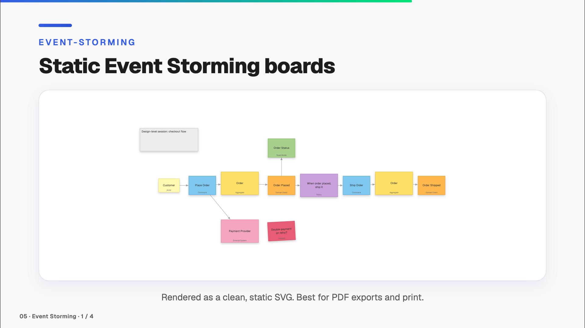

# Event Storming

[← Back to the overview](../README.md)



A static viewer and a live modeler for Event Storming boards. Files are boards (`.storm`) from the [Event Storming Modeler](https://github.com/Miragon/event-storming-modeler), rendered via [`@miragon/event-storming-renderer`](https://www.npmjs.com/package/@miragon/event-storming-renderer).

## `<EventStorming>` — Static viewer

Renders the file as a static SVG, the same way `<Bpmn>` does, so it also works in PDF and PNG exports.

```vue
<EventStorming eventStormingFilePath="./my-board.storm" height="400px" />
```

**Props:**

| Name | Type | Default | Description |
|------|------|---------|-------------|
| `eventStormingFilePath` | `string` | *required* | Path to the `.storm` file (relative to `public/`) |
| `width` | `string` | `'100%'` | Maximum width of the diagram |
| `height` | `string` | `'auto'` | Height of the diagram |

## `<EventStormingModeler>` — Live modeler

Shows a preview of the board in the slide. Clicking **Edit** opens the full modeler fullscreen, with its palette, context pad, label editing and undo/redo. On **Close**, your changes are reflected back in the preview. Changes live in the running presentation only; they are not written back to the file.

```vue
<EventStormingModeler eventStormingFilePath="./my-board.storm" height="400px" />
```

Or start with a blank canvas:

```vue
<EventStormingModeler height="400px" />
```

**Props:**

| Name | Type | Default | Description |
|------|------|---------|-------------|
| `eventStormingFilePath` | `string` | — | Optional path to the `.storm` file (relative to `public/`). Omit for a blank diagram. |
| `width` | `string` | `'100%'` | Width of the modeler container |
| `height` | `string` | `'500px'` | Height of the modeler container |

The renderer draws its labels in the Geist typeface when your deck provides it and falls back to a system sans-serif font otherwise.
