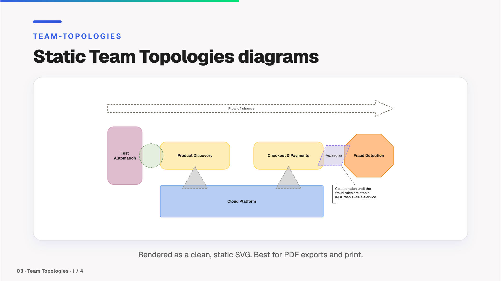

# Team Topologies

[← Back to the overview](../README.md)



A static viewer and a live modeler for Team Topologies diagrams. Files are Team Topologies documents (`.tt`, JSON) from the [Team Topologies Modeler](https://github.com/Miragon/team-topologies-modeler), rendered via [`@miragon/team-topologies-renderer`](https://www.npmjs.com/package/@miragon/team-topologies-renderer).

## `<TeamTopologies>` — Static viewer

Renders the file as a static SVG, the same way `<Bpmn>` does, so it also works in PDF and PNG exports.

```vue
<TeamTopologies teamTopologiesFilePath="./my-teams.tt" height="400px" />
```

**Props:**

| Name | Type | Default | Description |
|------|------|---------|-------------|
| `teamTopologiesFilePath` | `string` | *required* | Path to the `.tt` file (relative to `public/`) |
| `width` | `string` | `'100%'` | Maximum width of the diagram |
| `height` | `string` | `'auto'` | Height of the diagram |

## `<TeamTopologiesModeler>` — Live modeler

Shows a preview of the diagram in the slide. Clicking **Edit** opens the full modeler fullscreen, with its palette, context pad, label editing and undo/redo. On **Close**, your changes are reflected back in the preview. Changes live in the running presentation only; they are not written back to the file.

```vue
<TeamTopologiesModeler teamTopologiesFilePath="./my-teams.tt" height="400px" />
```

Or start with a blank canvas:

```vue
<TeamTopologiesModeler height="400px" />
```

**Props:**

| Name | Type | Default | Description |
|------|------|---------|-------------|
| `teamTopologiesFilePath` | `string` | — | Optional path to the `.tt` file (relative to `public/`). Omit for a blank diagram. |
| `width` | `string` | `'100%'` | Width of the modeler container |
| `height` | `string` | `'500px'` | Height of the modeler container |

The renderer draws its labels in the Geist typeface when your deck provides it and falls back to a system sans-serif font otherwise.
