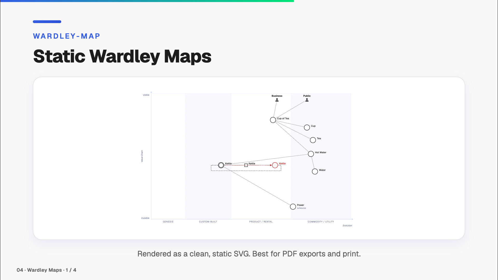

# Wardley Maps

[← Back to the overview](../README.md)



A static viewer and a live modeler for Wardley Maps. Files are maps in OWM text syntax (`.owm`) from the [Wardley Maps Modeler](https://github.com/Miragon/wardley-maps-modeler), rendered via [`@miragon/wardley-renderer`](https://www.npmjs.com/package/@miragon/wardley-renderer).

## `<WardleyMap>` — Static viewer

Renders the file as a static SVG, the same way `<Bpmn>` does, so it also works in PDF and PNG exports.

```vue
<WardleyMap wardleyMapFilePath="./my-map.owm" height="400px" />
```

**Props:**

| Name | Type | Default | Description |
|------|------|---------|-------------|
| `wardleyMapFilePath` | `string` | *required* | Path to the `.owm` file (relative to `public/`) |
| `width` | `string` | `'100%'` | Maximum width of the diagram |
| `height` | `string` | `'auto'` | Height of the diagram |

## `<WardleyMapModeler>` — Live modeler

Shows a preview of the map in the slide. Clicking **Edit** opens the full modeler fullscreen, with its palette, context pad, label editing and undo/redo. On **Close**, your changes are reflected back in the preview. Changes live in the running presentation only; they are not written back to the file.

```vue
<WardleyMapModeler wardleyMapFilePath="./my-map.owm" height="400px" />
```

Or start with a blank canvas:

```vue
<WardleyMapModeler height="400px" />
```

**Props:**

| Name | Type | Default | Description |
|------|------|---------|-------------|
| `wardleyMapFilePath` | `string` | — | Optional path to the `.owm` file (relative to `public/`). Omit for a blank diagram. |
| `width` | `string` | `'100%'` | Width of the modeler container |
| `height` | `string` | `'500px'` | Height of the modeler container |

The renderer draws its labels in the Geist typeface when your deck provides it and falls back to a system sans-serif font otherwise.
